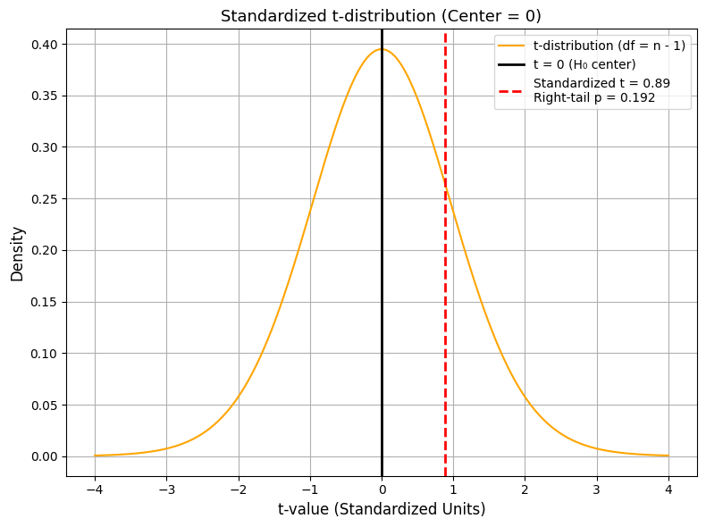

# Hypothesis Test

Table of Contents

- [Hypothesis Test](#hypothesis-test)
  - [What is a Hypothesis Test?](#what-is-a-hypothesis-test)
    - [Example:](#example)
    - [Topics to Be Discussed:](#topics-to-be-discussed)
  - [Why can the null hypothesis be described by a normal distribution?](#why-can-the-null-hypothesis-be-described-by-a-normal-distribution)
    - [Example:](#example-1)
  - [Case Study: Are the graduates’ salaries from a certain university significantly higher than the national average salary of $50,000?](#case-study-are-the-graduates-salaries-from-a-certain-university-significantly-higher-than-the-national-average-salary-of-50000)
    - [Test Statistic](#test-statistic)
    - [Standard Error vs. Standard Deviation](#standard-error-vs-standard-deviation)
      - [Why we use SE in hypothesis tests](#why-we-use-se-in-hypothesis-tests)
    - [How Do We Get from t-value to p-value?](#how-do-we-get-from-t-value-to-p-value)
      - [This likelihood is what we call the **p-value**.](#this-likelihood-is-what-we-call-the-p-value)
      - [How Do We Find the p-value?](#how-do-we-find-the-p-value)
      - [What Is Degrees of Freedom (df)?](#what-is-degrees-of-freedom-df)
    - [Critical Value and Significance Level (α)](#critical-value-and-significance-level-α)
      - [What Is a Significance Level (α)?](#what-is-a-significance-level-α)
      - [What Is a Critical Value?](#what-is-a-critical-value)
      - [How Do We Get Critical Value from Significance Level?](#how-do-we-get-critical-value-from-significance-level)

---

## What is a Hypothesis Test?

A hypothesis test is a statistical method used to make decisions or inferences about a population based on sample data. It helps you determine whether there is enough evidence to support a specific claim or hypothesis.

- **Null Hypothesis (H₀)**: This is the default assumption or status quo. For example, “There is no difference” or “The effect is zero.”

- **Alternative Hypothesis (H₁ or Ha)**: This is what you want to prove. For example, “There is a difference” or “The effect is not zero.”

---

### Example:

> Imagine we will investigate: *“Are the graduates’ salaries from a certain university significantly higher than the national average salary of $50,000?”*

- H₀: μ ≤ 50,000 (graduates’ salaries are not significantly higher than the national average of $50,000.)

- Ha: μ > 50,000 (reject null hypothesis)

<div align="center">
    
</div>

You can observe this in the diagram above:

- If the observed sample mean is **$52,000**, it lies close to the center of the null distribution (which assumes μ = $50,000). This makes it **less likely** that we would reject the null hypothesis.

- But if the observed mean were **$56,000**, much further from $50,000, we would be **more likely** to reject the null hypothesis.

- This decision is guided by the **p-value**.

In simpler terms:

- If the observed sample mean is **close to the null hypothesis mean**, the p-value will be **large**, and we **do not have strong evidence** to reject the null.

- If the observed sample mean is **far from the null mean**, the p-value will be **small**, and we **may have enough evidence** to reject the null.

---

### Topics to Be Discussed: 

- Why can the null hypothesis be described by a normal distribution?

- What is test statistic?

- How do we get p-value from t-value?

- How do we use p-value or critical value to make a decision?

- What is single tail or double tail hypothesis test?

---

## Why can the null hypothesis be described by a normal distribution?

Under certain conditions (especially with large sample sizes), the **[Central Limit Theorem](https://en.wikipedia.org/wiki/Central_limit_theorem)** tells us that the sampling distribution of the sample mean approaches a normal distribution — even if the population data is not normally distributed.

> This allows us to model the null hypothesis using a bell-shaped curve centered at the hypothesized mean (e.g., $50,000).

In simpler terms:

If the **true population** has an average salary of $50,000, and we **keep randomly picking 30 people at a time**, then **each time we calculate the average salary of those 30 people**. If we r**epeat this many times**, we’ll end up with **a bunch of averages**：

- The shape of these averages will look like a **normal (bell-shaped) distribution**, even if the original salary distribution is skewed or non-normal.

- This distribution of averages will **be centered around $50,000**, which is the population mean.

This result comes from the **Central Limit Theorem**, and it’s the reason we can use a normal distribution to model the **null hypothesis** when testing whether a sample mean is unusually far from $50,000.

---

### Example: 

The diagrams below illustrate a demonstration using a randomly generated **non-normal distribution**.

- A large dataset was generated from a **non-normal distribution**, as shown in the first set of plots:
  - The **left plot** displays a scatter of raw values.
  - The **right plot** shows the corresponding skewed histogram, centered near 1.

- From this dataset, the following procedure was conducted:
  - Randomly sample **30 data points** from the population.
  - Calculate the **mean** of each sample.
  - Repeat this process **500 times** to obtain a distribution of sample means.
  - Repeat the entire experiment **10 times**.

Each subplot below represents one experiment.

**Observations:**

- All 10 experiments yield **sample mean distributions** that are approximately **normal** in shape.
- The means consistently center around **1**, which is close to the population mean.
- This holds true **despite the underlying population distribution being skewed**.

> **Conclusion:**  
> This is a direct illustration of the **Central Limit Theorem (CLT)**:  
> Regardless of the original population’s shape, the distribution of sample means approaches a **normal distribution** as the number of samples increases — provided the sample size is reasonably large.

<div align="center">
    
</div>

<div align="center">
    
</div>

## Case Study: Are the graduates’ salaries from a certain university significantly higher than the national average salary of $50,000?

> **We will investigate:**  
> *Are the graduates’ salaries from a certain university significantly higher than the national average salary of $50,000?*
>
> The observed **sample mean salary is $51,018.95**, which appears to be higher than the national average.  
> But could this just be due to random chance?
>
> **In other words:**  
> Is this difference *statistically significant*?

### Test Statistic

- A **test statistic** is a number calculated from sample data that helps us decide whether to reject the null hypothesis.
- Common test statistics include the **t-value**, **z-value**, and **chi-square**.
- We use the test statistic to calculate a **p-value**, which tells us how extreme our sample result is under the assumption that the null hypothesis is true.
- In this example, we will use the **t-value** to demonstrate the core idea of hypothesis testing.
- To keep things simple, we won’t go into one-sample vs. two-sample t-tests or different types of t-tests — we’ll focus on the **intuition and process**.

**t-test formula:**

$$
t = \frac{\bar{x} - \mu_0}{s / \sqrt{n}}
$$

Where:
- $\bar{x}$: Sample mean
- $\mu_0$: Population mean under the null hypothesis  
- $s$: Sample standard deviation  
- $n$: Sample size
- ${s / \sqrt{n}}$: standard error

<div align="center">
    
</div>

> In the Graph Above:
>
> - On the **left-hand side**, we see the **null hypothesis distribution** of sample means, assumed from the Central Limit Theorem.  
>   This is centered at the null mean of **$50,000**.
>
> - A red dashed line marks the **observed sample mean** (e.g., **$51,018.95**).
>
> - On the **right-hand side**, we see the **standardized t-distribution** corresponding to the left plot:
>   - The center at **t = 0** maps to the null hypothesis mean (**$50,000**).
>   - The red dashed line at **t = 0.89** is calculated using the t-test formula:
>
>     ```
>     t = (𝑥̄ − μ₀) / (s / √n)
>     ```
>
>   - This t-value corresponds to the observed sample mean of **$51,018.95**.

It's important to note that the t-distribution is **not created by plugging raw data values one-by-one into the formula**.

Instead, it is a **theoretical model** that describes what the distribution of standardized sample means would look like **if you repeatedly**:

1. Drew random samples from the population,
2. Each with the same sample size $n$,
3. And calculated a t-value for each sample.

This collection of t-values forms the **t-distribution** we use to evaluate the significance of our observed sample.

---

### Standard Error vs. Standard Deviation

$\text{SE} = \frac{s}{\sqrt{n}}$ where $s$ is the sample standard deviation, and $n$ is the sample size 

A common question in statistics is:

> "Why do we use **standard error** instead of **standard deviation** in hypothesis testing?"

| Metric | Description |
|--------|-------------|
| **Standard Deviation (SD)** | - Measures how much individual data points vary around the **sample mean**<br> - It tells you about the **spread** of raw data<br>- Example: how spread out individual salaries are in your sample |
| **[Standard Error (SE)](https://www.youtube.com/watch?v=A82brFpdr9g&list=LL&index=2)** | - Measures how much **the sample mean itself** would vary if you repeated the sampling process many times<br>- Imagine you randomly sample 30 people over and over — you’ll get many different sample means. SE is like the **standard deviation of those sample means**.<br>- It tells you the **precision of the sample mean** as an estimate of the population mean. |

> The standard error is conceptually based on the idea of taking **many random samples** and calculating the standard deviation of their means. 
> However, what's interesting is that we can **estimate the standard error from just one sample** using the formula above.  
By using the sample’s own standard deviation and size, we get a reasonable estimate of how much the sample mean would vary if we repeated the sampling process.
> This is why we're able to calculate and use the standard error — even if we only have **one sample**.

#### Why we use SE in hypothesis tests

In hypothesis testing, we're not interested in how spread out the individual data points are — we're interested in **how far our sample mean might be** from the true population mean **due to random chance**.

That's why we standardize using **standard error**, not standard deviation.  
It allows us to compare our observed sample mean to a theoretical distribution of sample means under the null hypothesis.

---

### How Do We Get from t-value to p-value?

Once we calculate a **t-value** using the formula:

$$
t = \frac{\bar{x} - \mu_0}{s / \sqrt{n}}
$$

the next step is to ask:

> **"How likely is it to observe a t-value this extreme if the null hypothesis is actually true?"**

#### This likelihood is what we call the **p-value**.

- The **p-value** is the **area under the t-distribution curve** beyond your calculated t-value.
- It tells you the probability of getting a result **as extreme or more extreme** than what you observed — **just by random chance** under the null hypothesis.
- A **small p-value** suggests your observed result is **unlikely** under H₀, and may lead you to **reject the null hypothesis**.

#### How Do We Find the p-value?

We use the **t-distribution** (not the normal distribution) because the population standard deviation is unknown and we're estimating it from the sample:

```python
from scipy import stats

p_value = 1 - stats.t.cdf(t_value, df=n-1)
```

> Note: This is a right-tailed p-value. We’ll explore left-tail and two-tailed tests in later sections.

#### What Is Degrees of Freedom (df)?

Degrees of freedom means:
“How many values in your sample are free to vary once the sample mean is fixed.”

Example:

If you have 5 exam scores that must average 80:
You can freely choose 4 scores, but the 5th one is forced to keep the average at 80.
That’s why the degrees of freedom = 5 − 1 = 4.

In Our Case:

We calculated the p-value as 0.192 using Python.
You can see it shown in the standardized t-distribution graph above.

<div align="center">
    
</div>

But now the important question becomes:

Is 0.192 small enough to reject the null hypothesis?

That’s where we need to introduce the idea of a critical value or significance level (α) — which helps us decide what counts as “small.”

Great — this is an important part of statistical inference, and I’ll break it down clearly and beautifully for your learning or teaching materials.

---

### Critical Value and Significance Level (α)

#### What Is a Significance Level (α)?

- The **significance level (α)** is a threshold you choose **before** running a hypothesis test.
- It represents the **maximum probability** of rejecting a true null hypothesis.
- Common choices:  
  - α = 0.05 → 5% chance  
  - α = 0.01 → 1% chance

#### What Is a Critical Value?

- A **critical value** is the **cutoff point** on the t-distribution (or z-distribution) beyond which we say:  
  “This result is too extreme — we reject H₀.”
- It corresponds to your **chosen α level**, and depends on degrees of freedom.

> **Note**: These values (0.05, 0.01, etc.) are **not absolute rules** — they are **arbitrarily chosen conventions**.  The choice of α should depend on the context of your research, such as how serious the consequences of a false positive would be.

#### How Do We Get Critical Value from Significance Level?

To find the critical value for a **right-tailed** t-test:

```python
from scipy import stats

alpha = 0.05
df = n - 1
critical_value = stats.t.ppf(1 - alpha, df=df)
```

This gives you the t-value such that only α (e.g., 5%) of the area lies to its right.

<div align="center">
    
</div>

> Interpretation
>
> In our example:
>
> - The calculated **t-value is 0.89**, which is **less than** the critical value of **1.71**.
> - The corresponding **p-value is 0.192**, which is **greater than** the significance level of **0.05**.
>
> **Conclusion**:  
> We **fail to reject the null hypothesis**.  
> This means we **do not have enough evidence** to conclude that the graduates’ salaries from this university are **significantly higher** than the national average salary of **$50,000**.