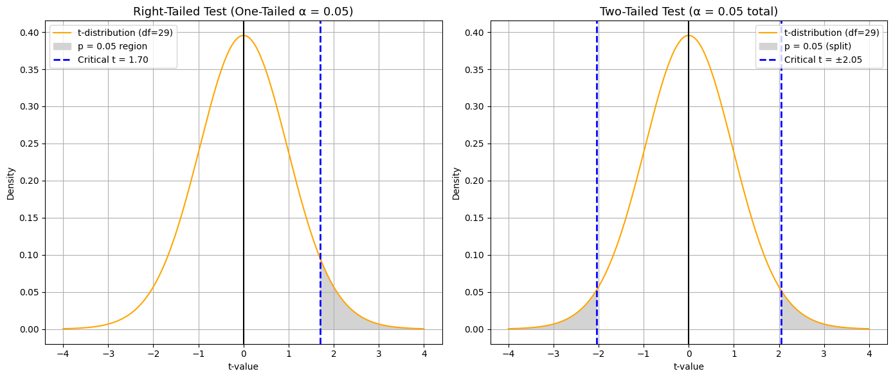

# Single-Tail vs. Double-Tail Hypothesis Tests

Table of Contents

- [Single-Tail vs. Double-Tail Hypothesis Tests](#single-tail-vs-double-tail-hypothesis-tests)
  - [What Is a Single-Tail Test?](#what-is-a-single-tail-test)
    - [Examples:](#examples)
  - [What Is a Double-Tail Test?](#what-is-a-double-tail-test)
    - [Example:](#example)
  - [Key Differences: One-Tailed vs. Two-Tailed (in Terms of p-value and Critical Value)](#key-differences-one-tailed-vs-two-tailed-in-terms-of-p-value-and-critical-value)

## What Is a Single-Tail Test?

A **single-tail (or one-sided)** test checks if the sample mean is **greater than** or **less than** the population mean — but **not both**.

- You choose one direction based on your research question.
- All of the α (significance level) is placed in **one tail** of the distribution.

### Examples:

Single Tail(Right Tail) Example: Are the graduates’ salaries from a certain university significantly higher than the national average salary of $50,000?

- H₀: μ ≤ 50,000  
  Ha: μ > 50,000 → **Right-tailed**
  
- H₀: μ ≥ 50,000  
  Ha: μ < 50,000 → **Left-tailed**

---

## What Is a Double-Tail Test?

A **double-tail (or two-sided)** test checks if the sample mean is **different** from the population mean — **in either direction**.

- You don’t care whether it's higher or lower — just whether it’s **significantly different**.
- The α is **split between both tails** of the distribution (α/2 in each tail).

### Example:

Double Tail Example: Are the graduates’ salaries from a certain university significantly different than the national average salary of $50,000?

- H₀: μ = 50,000  
  H₁: μ ≠ 50,000 → **Two-tailed**

> ✅ Use a **one-tailed** test when your research question clearly asks "greater than" or "less than".  
> ✅ Use a **two-tailed** test when you're testing for "any difference", regardless of direction.
---

## Key Differences: One-Tailed vs. Two-Tailed (in Terms of p-value and Critical Value)

| Feature                   | One-Tailed Test                                  | Two-Tailed Test                                          |
|---------------------------|---------------------------------------------------|-----------------------------------------------------------|
| **p-value**               | Area under the curve in **one direction only**   | Area in **both tails**, so it's **doubled**               |
| **How it's calculated**   | `p = 1 - cdf(t)` (or `p = cdf(t)` for left-tail) | `p = 2 * (1 - cdf(abs(t)))` (accounts for both extremes) |
| **Critical region**       | Entire α in **one tail**                         | α is **split**: α/2 in each tail                         |
| **Critical value**        | One cutoff (e.g., `t > tα`)                      | Two cutoffs (e.g., `t < -tα/2` or `t > tα/2`)             |
| **Stricter to reject H₀?**| No — easier to reject in one direction           | Yes — must be extreme in **either direction**             |

    

> Note: The graph above shows single tail critical value at 1.70, if you calculated and obtain a different value, it may caused by using different degree of freedom.